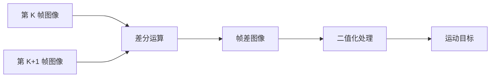
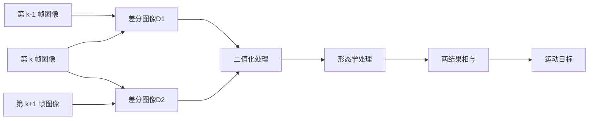

## 运动车辆检测方法研究

### 二帧差分法

图像帧 $f_{k}(x,y)$ , $f_{k+1}(x,y)$ 是视频中任意连续的两帧图像，对这两帧图像进行差分：

$$
D_{k}(x,y) = | f_{k}(x,y)-f_{k+1}(x,y)|
$$

$$
R_{k}(x,y) =
		\begin{cases}
   		1 \quad D_{k}(x,y) > T\\
   		0 \quad D_{k}(x,y) \leq T
      \end{cases}
$$

其中 T 为二值化阈值。

### 三帧差分法

### 四帧差分法

### 五帧差分法

### 七帧差分法

### 九帧差分法
