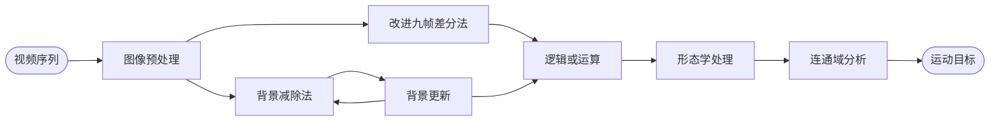

## 本文运动目标检测算法流程

### 改进九帧差分算法

1. 选取视频序列中连续的 9 帧图像，分别将其转换成对应的灰度图像，然后进行高通滤波处理增强图像，使得图像更加清晰锐利，得到相应滤波的 9 帧图像 ：
   $f_{k-4} (x,y)$，$f_{k-3} (x,y)$,$f_{k-2} (x,y)$,$f_{k-1} (x,y)$,$f_{k} (x,y)$,$f_{k+1} (x,y)$,$f_{k+2} (x,y)$,$f_{k+3} (x,y)$,$f_{k+4} (x,y)$

2. $f_{k}$ 为当前帧图像，分别与前 4 帧与后 4 帧进行差分运算：

   $$
   d_{1k} = f_{k} (x,y)-f_{k-4} (x,y)
   $$

   $$
   d_{2k} = f_{k} (x,y)-f_{k-3} (x,y)
   $$

   $$
   d_{3k} = f_{k} (x,y)-f_{k-2} (x,y)
   $$

   $$
   d_{4k} = f_{k} (x,y)-f_{k-1} (x,y)
   $$

   $$
   d_{5k} = f_{k} (x,y)-f_{k+1} (x,y)
   $$

   $$
   d_{6k} = f_{k} (x,y)-f_{k+2} (x,y)
   $$

   $$
   d_{7k} = f_{k} (x,y)-f_{k+3} (x,y)
   $$

   $$
   d_{8k} = f_{k} (x,y)-f_{k+4} (x,y)
   $$

   其中，$d_{1k}$,$d_{2k}$,$d_{3k}$,$d_{4k}$,$d_{5k}$,$d_{6k}$,$d_{7k}$,$d_{8k}$ 是差分后的图像。

3. 由于卫星拍摄的图像受到大气、云层等自然因素的影响，会导致图像的光照情况不均匀，这时候就需要进行图像增强，，而线性拉伸是其中最有效的方法之一。图像在经过线性拉伸之后，其亮度将更加突出，方便后续的运动目标检测。对步骤（2）得到的图像进行线性拉伸深运算:

   $$
   dnorm_{1k} = \frac { d_{1k}-min(d_{1k}) }  {max(d_{1k}) - min(d_{1k})}
   $$

   $$
   dnorm_{2k} = \frac { d_{2k}-min(d_{2k}) }  {max(d_{2k}) - min(d_{2k})}
   $$

   $$
   dnorm_{3k} = \frac { d_{3k}-min(d_{3k}) }  {max(d_{3k}) - min(d_{3k})}
   $$

   $$
   dnorm_{4k} = \frac { d_{4k}-min(d_{4k}) }  {max(d_{4k}) - min(d_{4k})}
   $$

   $$
   dnorm_{5k} = \frac { d_{5k}-min(d_{5k}) }  {max(d_{5k}) - min(d_{5k})}
   $$

   $$
   dnorm_{6k} = \frac { d_{6k}-min(d_{6k}) }  {max(d_{6k}) - min(d_{6k})}
   $$

   $$
   dnorm_{7k} = \frac { d_{7k}-min(d_{7k}) }  {max(d_{7k}) - min(d_{7k})}
   $$

   $$
   dnorm_{8k} = \frac { d_{8k}-min(d_{7k}) }  {max(d_{8k}) - min(d_{8k})}
   $$

4. 对步骤（3）得到的图像进行阈值分割：

   $$
   	dbw_{1k} =
   		\begin{cases}
   		1 \quad dnorm_{1k} > n_{1k}\\
   		0 \quad dnorm_{1k} \leq n_{1k}
   		\end{cases}
   $$

   $$
    	dbw_{2k} =
    		\begin{cases}
    		1 \quad dnorm_{2k} > n_{2k}\\
    		0 \quad dnorm_{2k} \leq n_{2k}
    		\end{cases}
   $$

   $$
    	dbw_{3k} =
    		\begin{cases}
    		1 \quad dnorm_{3k} > n_{3k}\\
    		0 \quad dnorm_{3k} \leq n_{3k}
    		\end{cases}
   $$

   $$
   	dbw_{4k} =
   		\begin{cases}
   		1 \quad dnorm_{4k} > n_{4k}\\
   		0 \quad dnorm_{4k} \leq n_{4k}
   		\end{cases}
   $$

   $$
   	dbw_{5k} =
   		\begin{cases}
   		1 \quad dnorm_{5k} > n_{5k}\\
   		0 \quad dnorm_{5k} \leq n_{5k}
   		\end{cases}
   $$

   $$
    	dbw_{6k} =
    		\begin{cases}
    		1 \quad dnorm_{6k} > n_{6k}\\
    		0 \quad dnorm_{6k} \leq n_{6k}
    		\end{cases}
   $$

   $$
    	dbw_{7k} =
    		\begin{cases}
    		1 \quad dnorm_{7k} > n_{7k}\\
    		0 \quad dnorm_{7k} \leq n_{7k}
    		\end{cases}
   $$

   $$
   	dbw_{8k} =
   		\begin{cases}
   		1 \quad dnorm_{8k} > n_{8k}\\
   		0 \quad dnorm_{8k} \leq n_{8k}
   		\end{cases}
   $$

   **n = 均值+a`*`标准差**

   $$
   n_{1k} = mean(mean(dnorm_{1k}))+4 * std2(dnorm_{1k});
   $$

   $$
   n_{2k} = mean(mean(dnorm_{2k}))+4 * std2(dnorm_{2k});
   $$

   $$
   n_{3k} = mean(mean(dnorm_{3k}))+4 * std2(dnorm_{3k});
   $$

   $$
   n_{4k} = mean(mean(dnorm_{4k}))+4 * std2(dnorm_{4k});
   $$

   $$
   n_{5k} = mean(mean(dnorm_{5k}))+4 * std2(dnorm_{5k});
   $$

   $$
   n_{6k} = mean(mean(dnorm_{6k}))+4 * std2(dnorm_{6k});
   $$

   $$
   n_{7k} = mean(mean(dnorm_{7k}))+4 * std2(dnorm_{7k});
   $$

   $$
   n_{8k} = mean(mean(dnorm_{8k}))+4 * std2(dnorm_{8k});
   $$

   其中，$dbw_{1k}$,$dbw_{2k}$,$dbw_{3k}$,$dbw_{4k}$,$dbw_{5k}$,$dbw_{6k}$,$dbw_{7k}$,$dbw_{8k}$ 是阈值分割后的图像，$n_{1k}$,$n_{2k}$,$n_{3k}$,$n_{4k}$,$n_{5k}$,$n_{6k}$,$n_{7k}$,$n_{8k}$ 均是动态阈值。

5. 对步骤（4）的图像进行“或”运算：

   $$
   d_1 = dbw_{1k}(x,y) \quad \oplus \quad   dbw_{2k}(x,y) \quad \oplus \quad dbw_{3k}(x,y) \quad \oplus \quad   dbw_{4k}(x,y)
   $$

   $$
   d_2 = dbw_{5k}(x,y) \quad  \oplus \quad   dbw_{6k}(x,y) \quad \oplus \quad dbw_{7k}(x,y) \quad \oplus \quad  dbw_{8k}(x,y)
   $$

6. 对步骤（5）得到的结果进行“或“运算，得到第 k 帧的图像

   $$
   d_{k}(x,y) =d_1 \quad  \oplus \quad  d_2
   $$

### 算法流程

目标检测的过程中，首先分别采用背景减除法和改进九帧差分法得到运动的目标，然后将这两种算法得到的图像进行逻辑“或”运算. 然后在采用连通性检测，提取运动目标区域，采用形态学处理来消除消除噪点并填补空间，从而得到完整的运动目标，算法如图所示：

### 实验仿真结果

利用上述描述的方法在普通ＰＣ机上，使用ＭＡＴＬＡＢ软件实现对遥感视频的处理。实验视频采用时长 1 分钟的遥感视频，帧率为 30 帧／秒。

## 总结
